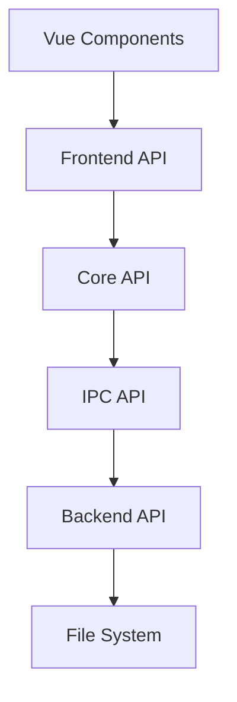

# Документация API Snowflake Desktop

## Обзор архитектуры API

Snowflake Desktop использует модульную архитектуру API, разделенную на несколько уровней:

1. **Frontend API (Vue/TS)** - API для взаимодействия между Vue компонентами
2. **Core API (TS)** - Основные модули бизнес-логики приложения
3. **IPC API (Tauri)** - API для коммуникации между фронтендом и бэкендом
4. **Backend API (Rust)** - Нативные функции, реализованные на Rust



## Frontend API

### StoreAPI

Интерфейсы для взаимодействия с Pinia Store.

#### ProjectStore

```typescript
interface ProjectStore {
  // Состояние
  currentProject: Project | null;
  recentProjects: RecentProject[];
  isLoading: boolean;

  // Геттеры
  hasCurrentProject: boolean;
  projectPath: string | null;

  // Действия
  createProject(name: string, path: string, type: ProjectType): Promise<void>;
  openProject(path: string): Promise<void>;
  closeProject(): Promise<void>;
  saveProject(): Promise<void>;
  exportProject(format: ExportFormat, options: ExportOptions): Promise<void>;
}
```

#### BookStore

```typescript
interface BookStore {
  // Состояние
  books: Book[];
  series: Series[];
  authors: Author[];

  // Геттеры
  bookById(id: string): Book | undefined;
  seriesById(id: string): Series | undefined;
  authorById(id: string): Author | undefined;

  // Действия
  createBook(book: BookCreateDTO): Promise<string>;
  updateBook(id: string, data: BookUpdateDTO): Promise<void>;
  deleteBook(id: string): Promise<void>;
  createSeries(series: SeriesCreateDTO): Promise<string>;
  updateSeries(id: string, data: SeriesUpdateDTO): Promise<void>;
  deleteSeries(id: string): Promise<void>;
  createAuthor(author: AuthorCreateDTO): Promise<string>;
  updateAuthor(id: string, data: AuthorUpdateDTO): Promise<void>;
  deleteAuthor(id: string): Promise<void>;
}
```

#### LoreStore

```typescript
interface LoreStore {
  // Состояние
  characters: Character[];
  locations: Location[];
  items: Item[];
  events: Event[];

  // Геттеры
  characterById(id: string): Character | undefined;
  locationById(id: string): Location | undefined;
  itemById(id: string): Item | undefined;
  eventById(id: string): Event | undefined;

  // Действия
  createCharacter(character: CharacterCreateDTO): Promise<string>;
  updateCharacter(id: string, data: CharacterUpdateDTO): Promise<void>;
  deleteCharacter(id: string): Promise<void>;
  // Аналогичные методы для других сущностей...
}
```

#### ProjectionStore

```typescript
interface ProjectionStore {
  // Состояние
  chapters: Record<string, Chapter[]>; // bookId -> chapters
  stages: Stage[];
  timelineEvents: TimelineEvent[];
  characterMap: CharacterConnection[];

  // Геттеры
  chaptersByBookId(bookId: string): Chapter[];
  stagesByChapterId(chapterId: string): Stage[];

  // Действия
  createChapter(bookId: string, chapter: ChapterCreateDTO): Promise<string>;
  updateChapter(id: string, data: ChapterUpdateDTO): Promise<void>;
  deleteChapter(id: string): Promise<void>;
  createStage(stage: StageCreateDTO): Promise<string>;
  updateStage(id: string, data: StageUpdateDTO): Promise<void>;
  deleteStage(id: string): Promise<void>;
  // Другие методы для работы с проекциями...
}
```

### RouterAPI

```typescript
// Доступные маршруты приложения
enum AppRoute {
  HOME = '/',
  PROJECT = '/project',
  BOOKS = '/books',
  BOOK_EDITOR = '/books/:id',
  SERIES_EDITOR = '/series/:id',
  AUTHOR_EDITOR = '/authors/:id',
  CHARACTERS = '/characters',
  CHARACTER_EDITOR = '/characters/:id',
  LOCATIONS = '/locations',
  LOCATION_EDITOR = '/locations/:id',
  TIMELINE = '/timeline',
  PLAN = '/plan',
  CHARACTER_MAP = '/character-map',
  STAGES = '/stages',
  SETTINGS = '/settings',
}

// Навигационные хуки
interface RouterAPI {
  navigateTo(route: AppRoute, params?: Record<string, string>): void;
  navigateBack(): void;
  getCurrentRoute(): AppRoute;
}
```

## Core API

### ProjectManager

```typescript
interface ProjectManager {
  createProject(
    name: string,
    path: string,
    type: ProjectType
  ): Promise<Project>;
  openProject(path: string): Promise<Project>;
  closeProject(): Promise<void>;
  saveProject(): Promise<void>;
  exportProject(format: ExportFormat, options: ExportOptions): Promise<string>;
  importProject(path: string): Promise<Project>;
  validateProject(path: string): Promise<boolean>;
}
```

### DataManager

```typescript
interface DataManager<T> {
  getAll(): Promise<T[]>;
  getById(id: string): Promise<T | null>;
  create(data: Omit<T, 'id'>): Promise<T>;
  update(id: string, data: Partial<T>): Promise<T>;
  delete(id: string): Promise<void>;
  query(filter: Partial<T>): Promise<T[]>;
}
```

### BookManager

```typescript
interface BookManager {
  getBooks(): Promise<Book[]>;
  getBook(id: string): Promise<Book | null>;
  createBook(data: BookCreateDTO): Promise<Book>;
  updateBook(id: string, data: BookUpdateDTO): Promise<Book>;
  deleteBook(id: string): Promise<void>;

  getSeries(): Promise<Series[]>;
  getSeries(id: string): Promise<Series | null>;
  createSeries(data: SeriesCreateDTO): Promise<Series>;
  updateSeries(id: string, data: SeriesUpdateDTO): Promise<Series>;
  deleteSeries(id: string): Promise<void>;

  getAuthors(): Promise<Author[]>;
  getAuthor(id: string): Promise<Author | null>;
  createAuthor(data: AuthorCreateDTO): Promise<Author>;
  updateAuthor(id: string, data: AuthorUpdateDTO): Promise<Author>;
  deleteAuthor(id: string): Promise<void>;
}
```

### ChapterManager

```typescript
interface ChapterManager {
  getChapters(bookId: string): Promise<Chapter[]>;
  getChapter(id: string): Promise<Chapter | null>;
  createChapter(bookId: string, data: ChapterCreateDTO): Promise<Chapter>;
  updateChapter(id: string, data: ChapterUpdateDTO): Promise<Chapter>;
  deleteChapter(id: string): Promise<void>;

  getChapterText(chapterId: string): Promise<string>;
  updateChapterText(chapterId: string, text: string): Promise<void>;

  reorderChapters(bookId: string, chapterIds: string[]): Promise<void>;
}
```

### StageManager

```typescript
interface StageManager {
  getStages(filters?: StageFilters): Promise<Stage[]>;
  getStage(id: string): Promise<Stage | null>;
  createStage(data: StageCreateDTO): Promise<Stage>;
  updateStage(id: string, data: StageUpdateDTO): Promise<Stage>;
  deleteStage(id: string): Promise<void>;

  getStagesByChapter(chapterId: string): Promise<Stage[]>;
  getStagesByCharacter(characterId: string): Promise<Stage[]>;
  getStagesByLocation(locationId: string): Promise<Stage[]>;

  updateStageStatus(id: string, status: StageStatus): Promise<Stage>;
}
```

### LoreManager

```typescript
interface LoreManager {
  getCharacters(): Promise<Character[]>;
  getCharacter(id: string): Promise<Character | null>;
  createCharacter(data: CharacterCreateDTO): Promise<Character>;
  updateCharacter(id: string, data: CharacterUpdateDTO): Promise<Character>;
  deleteCharacter(id: string): Promise<void>;

  // Аналогичные методы для локаций, предметов и событий...

  getCharacterRelations(): Promise<CharacterRelation[]>;
  createCharacterRelation(
    data: CharacterRelationCreateDTO
  ): Promise<CharacterRelation>;
  updateCharacterRelation(
    id: string,
    data: CharacterRelationUpdateDTO
  ): Promise<CharacterRelation>;
  deleteCharacterRelation(id: string): Promise<void>;
}
```

## IPC API (Tauri Commands)

### FileSystem Commands

```typescript
// Команды для работы с файловой системой
interface FileSystemCommands {
  readTextFile(path: string): Promise<string>;
  writeTextFile(path: string, contents: string): Promise<void>;
  readBinaryFile(path: string): Promise<Uint8Array>;
  writeBinaryFile(path: string, contents: Uint8Array): Promise<void>;
  readDir(path: string): Promise<FileEntry[]>;
  createDir(path: string, recursive?: boolean): Promise<void>;
  removeDir(path: string, recursive?: boolean): Promise<void>;
  removeFile(path: string): Promise<void>;
  copyFile(source: string, destination: string): Promise<void>;
  moveFile(source: string, destination: string): Promise<void>;
}
```

### Dialogs Commands

```typescript
// Команды для работы с диалоговыми окнами
interface DialogCommands {
  open(options: OpenDialogOptions): Promise<string | string[] | null>;
  save(options: SaveDialogOptions): Promise<string | null>;
  message(options: MessageDialogOptions): Promise<void>;
  confirm(options: ConfirmDialogOptions): Promise<boolean>;
}
```

### Project Commands

```typescript
// Команды для работы с проектами
interface ProjectCommands {
  createProject(name: string, path: string, type: string): Promise<void>;
  openProject(path: string): Promise<Project>;
  saveProject(project: Project, path: string): Promise<void>;
  exportProject(project: Project, path: string, format: string): Promise<void>;
  importProject(path: string): Promise<Project>;
}
```

## Backend API (Rust)

### FileManagerAPI

```rust
/// API для работы с файловой системой
pub trait FileManager {
    /// Читает текстовый файл
    fn read_text_file(&self, path: &str) -> Result<String, Error>;

    /// Записывает текстовый файл
    fn write_text_file(&self, path: &str, content: &str) -> Result<(), Error>;

    /// Читает бинарный файл
    fn read_binary_file(&self, path: &str) -> Result<Vec<u8>, Error>;

    /// Записывает бинарный файл
    fn write_binary_file(&self, path: &str, content: &[u8]) -> Result<(), Error>;

    /// Создает директорию
    fn create_dir(&self, path: &str, recursive: bool) -> Result<(), Error>;

    /// Перемещает файл или директорию
    fn move_item(&self, source: &str, destination: &str) -> Result<(), Error>;

    /// Удаляет файл или директорию
    fn remove_item(&self, path: &str, recursive: bool) -> Result<(), Error>;

    /// Проверяет существование файла или директории
    fn exists(&self, path: &str) -> Result<bool, Error>;
}
```

### ProjectManagerAPI

```rust
/// API для управления проектами
pub trait ProjectManager {
    /// Создает новый проект
    fn create_project(&self, name: &str, path: &str, project_type: ProjectType) -> Result<Project, Error>;

    /// Открывает существующий проект
    fn open_project(&self, path: &str) -> Result<Project, Error>;

    /// Сохраняет проект
    fn save_project(&self, project: &Project) -> Result<(), Error>;

    /// Экспортирует проект в указанный формат
    fn export_project(&self, project: &Project, path: &str, format: ExportFormat) -> Result<(), Error>;

    /// Создает резервную копию проекта
    fn create_backup(&self, project: &Project) -> Result<String, Error>;

    /// Восстанавливает проект из резервной копии
    fn restore_from_backup(&self, backup_path: &str) -> Result<Project, Error>;
}
```

### ExportManagerAPI

```rust
/// API для экспорта данных
pub trait ExportManager {
    /// Экспортирует книгу в DOCX формат
    fn export_to_docx(&self, book: &Book, path: &str, options: &DocxOptions) -> Result<(), Error>;

    /// Экспортирует книгу в PDF формат
    fn export_to_pdf(&self, book: &Book, path: &str, options: &PdfOptions) -> Result<(), Error>;

    /// Экспортирует материалы лора в HTML
    fn export_lore_to_html(&self, project: &Project, path: &str, options: &HtmlOptions) -> Result<(), Error>;

    /// Создает архив проекта в формате .snflk
    fn create_snflk_archive(&self, project: &Project, path: &str) -> Result<(), Error>;

    /// Извлекает проект из архива .snflk
    fn extract_from_snflk(&self, archive_path: &str, destination_path: &str) -> Result<(), Error>;
}
```

## Модели данных

### Project

```typescript
interface Project {
  id: string;
  name: string;
  path: string;
  type: ProjectType;
  createdAt: string;
  updatedAt: string;
  settings: ProjectSettings;
}

enum ProjectType {
  SINGLE_BOOK = 'single_book',
  SERIES = 'series',
}

interface ProjectSettings {
  autoSaveInterval: number;
  maxBackupCount: number;
  theme: 'light' | 'dark' | 'system';
  language: 'ru' | 'en';
  dateFormat: string;
  numberFormat: string;
}
```

### Book

```typescript
interface Book {
  id: string;
  title: string;
  description: string;
  authorIds: string[];
  publicationDate?: string;
  pages?: number;
  isbn?: string;
  genres: string[];
  status: BookStatus;
  relations: BookRelation[];
  annotation?: string;
  synopsis?: string;
  coverImagePath?: string;
  seriesId?: string;
  orderInSeries?: number;
}

enum BookStatus {
  PLANNING = 'planning',
  DRAFT = 'draft',
  REVISION = 'revision',
  EDITING = 'editing',
  PUBLISHED = 'published',
}

interface BookRelation {
  targetBookId: string;
  relationType: BookRelationType;
}

enum BookRelationType {
  SEQUEL = 'sequel',
  PREQUEL = 'prequel',
  SPINOFF = 'spinoff',
  SIDESTORY = 'sidestory',
  ADAPTATION = 'adaptation',
  REMAKE = 'remake',
  ALTERNATIVE = 'alternative',
}
```

### Другие модели

Аналогичные спецификации доступны для всех остальных моделей данных:

- Series
- Author
- Character
- Location
- Item
- Event
- Chapter
- Stage
- и т.д.

## Примеры использования API

### Пример создания проекта

```typescript
import { useProjectStore } from '@/stores/project';

const projectStore = useProjectStore();
const createProject = async () => {
  try {
    await projectStore.createProject(
      'Моя новая книга',
      '/path/to/project',
      'single_book'
    );
    console.log('Проект успешно создан');
  } catch (error) {
    console.error('Ошибка при создании проекта:', error);
  }
};
```

### Пример создания персонажа

```typescript
import { useLoreStore } from '@/stores/lore';

const loreStore = useLoreStore();
const createCharacter = async () => {
  try {
    const characterId = await loreStore.createCharacter({
      name: 'Иван Петров',
      age: 30,
      biography: 'Краткая биография персонажа...',
      traits: ['храбрый', 'умный', 'любопытный'],
      imagePath: '/characters/ivan.jpg',
    });
    console.log('Персонаж создан с ID:', characterId);
  } catch (error) {
    console.error('Ошибка при создании персонажа:', error);
  }
};
```

### Пример работы с главами

```typescript
import { useProjectionStore } from '@/stores/projection';
import { useCurrentBook } from '@/composables/book';

const projectionStore = useProjectionStore();
const { currentBook } = useCurrentBook();

const createNewChapter = async () => {
  if (!currentBook.value) return;

  try {
    const chapterId = await projectionStore.createChapter(
      currentBook.value.id,
      {
        title: 'Глава 1',
        description: 'Введение в мир книги',
      }
    );

    // Добавляем текст в созданную главу
    await projectionStore.updateChapterText(chapterId, 'Текст первой главы...');

    console.log('Глава создана с ID:', chapterId);
  } catch (error) {
    console.error('Ошибка при создании главы:', error);
  }
};
```

## Рекомендации по использованию API

1. **Использование хранилищ (Stores)** - Всегда работайте с данными через Pinia Store, а не напрямую с API.
2. **Обработка ошибок** - Всегда оборачивайте вызовы API в try/catch блоки для корректной обработки ошибок.
3. **Типизация** - Используйте TypeScript интерфейсы для обеспечения типобезопасности.
4. **Асинхронность** - Все методы API возвращают Promise, используйте async/await для работы с ними.
5. **Кэширование** - По возможности кэшируйте данные для улучшения производительности.
6. **Актуализация данных** - Обновляйте данные в UI после изменений в хранилище.

## Рекомендации для разработчиков

1. Придерживайтесь указанных интерфейсов при реализации новых функций
2. Документируйте все изменения в API в этом документе
3. Следуйте принципам SOLID при проектировании новых API
4. Обеспечивайте совместимость при изменении существующих API
5. Разрабатывайте тесты для всех новых API
