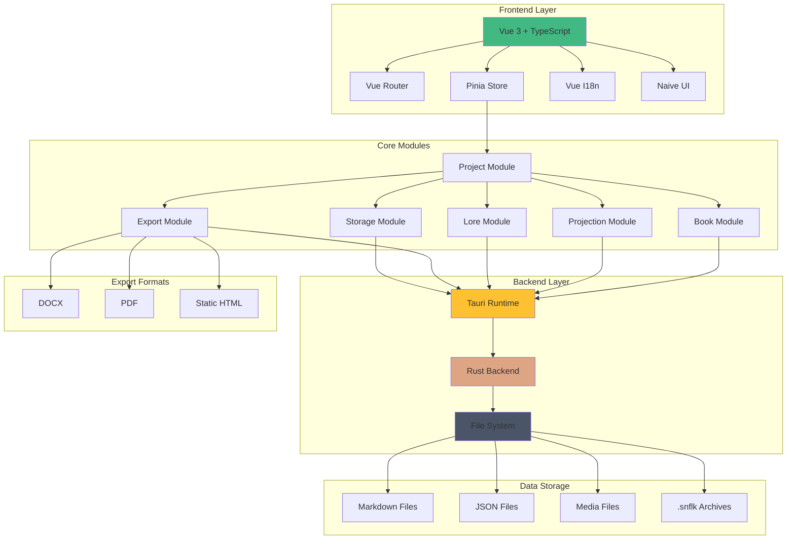

# Архитектура Snowflake

## Ландшафт системы

## Описание компонентов

### Frontend Layer

- **Vue 3 + TypeScript**: Основной фреймворк для разработки пользовательского интерфейса
- **Vue Router**: Маршрутизация в приложении
- **Pinia Store**: Управление состоянием приложения
- **Vue I18n**: Интернационализация
- **Naive UI**: Библиотека UI компонентов

### Core Modules

- **Project Module**: Управление проектами и их конфигурацией
- **Book Module**: Управление книгами и сериями
- **Projection Module**: Планирование и структурирование книг
- **Lore Module**: Управление миром и персонажами
- **Export Module**: Экспорт в различные форматы
- **Storage Module**: Управление хранением данных

### Backend Layer

- **Tauri Runtime**: Десктоп-окружение
- **Rust Backend**: Нативные операции и бизнес-логика
- **File System**: Работа с файловой системой

### Data Storage

- **Markdown Files**: Хранение текстового контента
- **JSON Files**: Хранение структурированных данных
- **Media Files**: Хранение изображений и медиа
- **SNFLK Archives**: Архивы проектов

### Export Formats

- **DOCX**: Экспорт в формат Microsoft Word
- **PDF**: Экспорт в PDF формат
- **HTML**: Экспорт в статические веб-страницы

## Взаимодействие компонентов

1. Frontend взаимодействует с Core Modules через Pinia Store
2. Core Modules обращаются к Backend Layer через Tauri API
3. Backend Layer управляет данными через File System
4. Export Module генерирует различные форматы документов
5. Storage Module управляет всеми типами хранимых данных

## Особенности архитектуры

- Модульная структура для легкого расширения
- Четкое разделение ответственности между слоями
- Использование нативных возможностей через Rust
- Гибкая система хранения данных
- Поддержка различных форматов экспорта

## Технические детали реализации

1. Использование папки для проекта
2. Хранение данных в виде .md и .json файлов + медиа файлы (картинки .jpg, .png)
3. Использование структуры папок для организации данных
4. Генерация zip папки в формате .snflk (для хранения копии проекта)
5. Импорт проекта из .snflk
6. Экспорт проекта в разных срезах и форматах:
   - Книга в docx, pdf
   - Лор мира в статический html + assets с медиа
   - Материалы для издательств docx
   - Особая разметка книги в формате docx для редактора/корректора с возможностью обратной синхронизации текстов

## Критерии качества

### Производительность

- Время отклика <200ms
- Оптимальное использование памяти
- Стабильная работа при максимальной нагрузке

### Надежность

- Автосохранение каждые 5 минут
- Восстановление после сбоев
- Резервное копирование данных

### Безопасность

- Шифрование чувствительных данных
- Защита от инъекций
- Безопасное хранение данных

### Юзабилити

- Интуитивно понятный интерфейс
- Наличие подсказок
- Поддержка клавиатурной навигации
