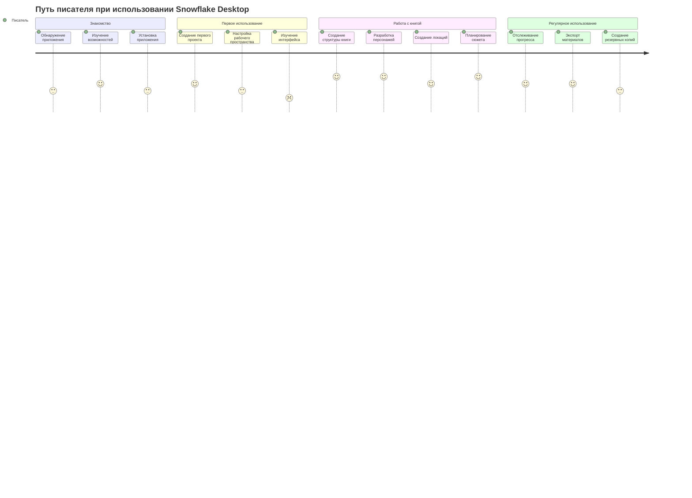
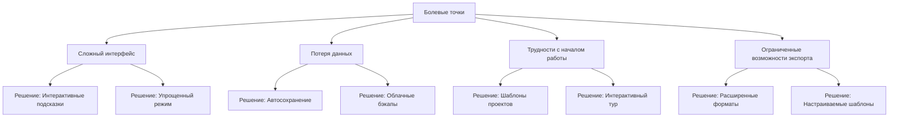

# Карта пути клиента (Customer Journey Map)

## Обзор

Карта пути клиента представляет собой визуализацию процесса взаимодействия писателя с приложением Snowflake Desktop от первого знакомства до регулярного использования в работе над литературными произведениями.

## Этапы пути клиента

## Детальный анализ пути клиента

### 1. Знакомство

| Этап                   | Действия пользователя                                          | Точки контакта                          | Эмоции                          | Возможности для улучшения                                         |
| ---------------------- | -------------------------------------------------------------- | --------------------------------------- | ------------------------------- | ----------------------------------------------------------------- |
| Обнаружение приложения | Поиск инструментов для писателей, чтение обзоров, рекомендации | Сайт, социальные сети, форумы писателей | Заинтересованность, любопытство | Улучшение SEO, отзывы пользователей, демонстрационные видео       |
| Изучение возможностей  | Чтение описания, просмотр скриншотов, сравнение с аналогами    | Сайт, документация, обзоры              | Оценка, анализ                  | Более наглядные примеры использования, интерактивная демонстрация |
| Установка приложения   | Загрузка, установка, первый запуск                             | Страница загрузки, установщик           | Ожидание, нетерпение            | Упрощение процесса установки, уменьшение размера дистрибутива     |

### 2. Первое использование

| Этап                            | Действия пользователя                         | Точки контакта         | Эмоции                   | Возможности для улучшения                                |
| ------------------------------- | --------------------------------------------- | ---------------------- | ------------------------ | -------------------------------------------------------- |
| Создание первого проекта        | Заполнение информации о проекте, выбор типа   | Форма создания проекта | Энтузиазм, неуверенность | Шаблоны проектов, пошаговые подсказки                    |
| Настройка рабочего пространства | Изучение настроек, адаптация под свои нужды   | Меню настроек          | Исследование, адаптация  | Предустановленные профили настроек, визуальные подсказки |
| Изучение интерфейса             | Навигация по разделам, знакомство с функциями | Интерфейс приложения   | Возможная растерянность  | Интерактивный тур по приложению, всплывающие подсказки   |

### 3. Работа с книгой

| Этап                     | Действия пользователя                | Точки контакта    | Эмоции                          | Возможности для улучшения                |
| ------------------------ | ------------------------------------ | ----------------- | ------------------------------- | ---------------------------------------- |
| Создание структуры книги | Добавление глав, сцен, планирование  | Модуль структуры  | Творческий процесс, организация | Визуализация структуры, шаблоны структур |
| Разработка персонажей    | Создание карточек персонажей, связей | Модуль персонажей | Творческое вдохновение          | Генератор имен, шаблоны архетипов        |
| Создание локаций         | Описание мест действия, связи        | Модуль локаций    | Погружение в мир                | Визуальный редактор карт, референсы      |
| Планирование сюжета      | Создание сюжетных линий, арок        | Модуль сюжета     | Стратегическое мышление         | Анализ сюжетных структур, подсказки      |

### 4. Регулярное использование

| Этап                     | Действия пользователя                    | Точки контакта       | Эмоции                       | Возможности для улучшения           |
| ------------------------ | ---------------------------------------- | -------------------- | ---------------------------- | ----------------------------------- |
| Отслеживание прогресса   | Обновление статусов, просмотр статистики | Дашборд, статистика  | Мотивация, контроль          | Визуализация прогресса, напоминания |
| Экспорт материалов       | Выбор формата, настройка экспорта        | Модуль экспорта      | Удовлетворение от результата | Больше форматов, предпросмотр       |
| Создание резервных копий | Настройка автосохранения, бэкапы         | Настройки сохранения | Безопасность, спокойствие    | Облачное хранение, автоматизация    |

## Болевые точки и решения

## Ключевые метрики успеха

1. **Активация**: Процент пользователей, создавших полноценный проект книги после установки
2. **Удержание**: Частота и продолжительность сессий работы с приложением
3. **Вовлеченность**: Количество созданных элементов (персонажи, локации, сцены)
4. **Завершение**: Процент проектов, достигших статуса "Завершено"
5. **Удовлетворенность**: Оценки пользователей, отзывы, количество рекомендаций

## Рекомендации по улучшению пути клиента

1. **Онбординг**: Разработать интерактивный тур по основным функциям приложения
2. **Шаблоны**: Создать набор готовых шаблонов для разных жанров литературы
3. **Геймификация**: Внедрить элементы геймификации для повышения мотивации
4. **Сообщество**: Создать платформу для обмена опытом между пользователями
5. **Интеграции**: Добавить интеграции с популярными сервисами для писателей

## Английская версия (English Version)

Для создания английской версии этого документа, пожалуйста, используйте команду перевода и сохраните результат в папке `docs/en/customer-journey-map.md`.
