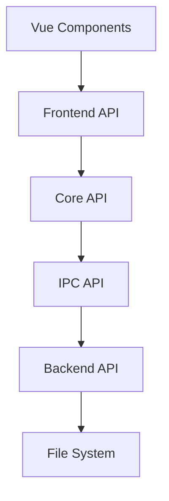

# Snowflake Desktop API Documentation

## API Architecture Overview

Snowflake Desktop uses a modular API architecture divided into several layers:

1. **Frontend API (Vue/TS)** - API for interaction between Vue components
2. **Core API (TS)** - Core application business logic modules
3. **IPC API (Tauri)** - API for communication between frontend and backend
4. **Backend API (Rust)** - Native functions implemented in Rust



## Frontend API

### StoreAPI

Interfaces for interaction with Pinia Store.

#### ProjectStore

```typescript
interface ProjectStore {
  // State
  currentProject: Project | null;
  recentProjects: RecentProject[];
  isLoading: boolean;

  // Getters
  hasCurrentProject: boolean;
  projectPath: string | null;

  // Actions
  createProject(name: string, path: string, type: ProjectType): Promise<void>;
  openProject(path: string): Promise<void>;
  closeProject(): Promise<void>;
  saveProject(): Promise<void>;
  exportProject(format: ExportFormat, options: ExportOptions): Promise<void>;
}
```

#### BookStore

```typescript
interface BookStore {
  // State
  books: Book[];
  series: Series[];
  authors: Author[];

  // Getters
  bookById(id: string): Book | undefined;
  seriesById(id: string): Series | undefined;
  authorById(id: string): Author | undefined;

  // Actions
  createBook(book: BookCreateDTO): Promise<string>;
  updateBook(id: string, data: BookUpdateDTO): Promise<void>;
  deleteBook(id: string): Promise<void>;
  createSeries(series: SeriesCreateDTO): Promise<string>;
  updateSeries(id: string, data: SeriesUpdateDTO): Promise<void>;
  deleteSeries(id: string): Promise<void>;
  createAuthor(author: AuthorCreateDTO): Promise<string>;
  updateAuthor(id: string, data: AuthorUpdateDTO): Promise<void>;
  deleteAuthor(id: string): Promise<void>;
}
```

#### LoreStore

```typescript
interface LoreStore {
  // State
  characters: Character[];
  locations: Location[];
  items: Item[];
  events: Event[];

  // Getters
  characterById(id: string): Character | undefined;
  locationById(id: string): Location | undefined;
  itemById(id: string): Item | undefined;
  eventById(id: string): Event | undefined;

  // Actions
  createCharacter(character: CharacterCreateDTO): Promise<string>;
  updateCharacter(id: string, data: CharacterUpdateDTO): Promise<void>;
  deleteCharacter(id: string): Promise<void>;
  // Similar methods for other entities...
}
```

#### ProjectionStore

```typescript
interface ProjectionStore {
  // State
  chapters: Record<string, Chapter[]>; // bookId -> chapters
  stages: Stage[];
  timelineEvents: TimelineEvent[];
  characterMap: CharacterConnection[];

  // Getters
  chaptersByBookId(bookId: string): Chapter[];
  stagesByChapterId(chapterId: string): Stage[];

  // Actions
  createChapter(bookId: string, chapter: ChapterCreateDTO): Promise<string>;
  updateChapter(id: string, data: ChapterUpdateDTO): Promise<void>;
  deleteChapter(id: string): Promise<void>;
  createStage(stage: StageCreateDTO): Promise<string>;
  updateStage(id: string, data: StageUpdateDTO): Promise<void>;
  deleteStage(id: string): Promise<void>;
  // Other methods for working with projections...
}
```

### RouterAPI

```typescript
// Available application routes
enum AppRoute {
  HOME = '/',
  PROJECT = '/project',
  BOOKS = '/books',
  BOOK_EDITOR = '/books/:id',
  SERIES_EDITOR = '/series/:id',
  AUTHOR_EDITOR = '/authors/:id',
  CHARACTERS = '/characters',
  CHARACTER_EDITOR = '/characters/:id',
  LOCATIONS = '/locations',
  LOCATION_EDITOR = '/locations/:id',
  TIMELINE = '/timeline',
  PLAN = '/plan',
  CHARACTER_MAP = '/character-map',
  STAGES = '/stages',
  SETTINGS = '/settings',
}

// Navigation hooks
interface RouterAPI {
  navigateTo(route: AppRoute, params?: Record<string, string>): void;
  navigateBack(): void;
  getCurrentRoute(): AppRoute;
}
```

## Core API

### ProjectManager

```typescript
interface ProjectManager {
  createProject(
    name: string,
    path: string,
    type: ProjectType
  ): Promise<Project>;
  openProject(path: string): Promise<Project>;
  closeProject(): Promise<void>;
  saveProject(): Promise<void>;
  exportProject(format: ExportFormat, options: ExportOptions): Promise<string>;
  importProject(path: string): Promise<Project>;
  validateProject(path: string): Promise<boolean>;
}
```

### DataManager

```typescript
interface DataManager<T> {
  getAll(): Promise<T[]>;
  getById(id: string): Promise<T | null>;
  create(data: Omit<T, 'id'>): Promise<T>;
  update(id: string, data: Partial<T>): Promise<T>;
  delete(id: string): Promise<void>;
  query(filter: Partial<T>): Promise<T[]>;
}
```

### BookManager

```typescript
interface BookManager {
  getBooks(): Promise<Book[]>;
  getBook(id: string): Promise<Book | null>;
  createBook(data: BookCreateDTO): Promise<Book>;
  updateBook(id: string, data: BookUpdateDTO): Promise<Book>;
  deleteBook(id: string): Promise<void>;

  getSeries(): Promise<Series[]>;
  getSeries(id: string): Promise<Series | null>;
  createSeries(data: SeriesCreateDTO): Promise<Series>;
  updateSeries(id: string, data: SeriesUpdateDTO): Promise<Series>;
  deleteSeries(id: string): Promise<void>;

  getAuthors(): Promise<Author[]>;
  getAuthor(id: string): Promise<Author | null>;
  createAuthor(data: AuthorCreateDTO): Promise<Author>;
  updateAuthor(id: string, data: AuthorUpdateDTO): Promise<Author>;
  deleteAuthor(id: string): Promise<void>;
}
```

### ChapterManager

```typescript
interface ChapterManager {
  getChapters(bookId: string): Promise<Chapter[]>;
  getChapter(id: string): Promise<Chapter | null>;
  createChapter(bookId: string, data: ChapterCreateDTO): Promise<Chapter>;
  updateChapter(id: string, data: ChapterUpdateDTO): Promise<Chapter>;
  deleteChapter(id: string): Promise<void>;

  getChapterText(chapterId: string): Promise<string>;
  updateChapterText(chapterId: string, text: string): Promise<void>;

  reorderChapters(bookId: string, chapterIds: string[]): Promise<void>;
}
```

### StageManager

```typescript
interface StageManager {
  getStages(filters?: StageFilters): Promise<Stage[]>;
  getStage(id: string): Promise<Stage | null>;
  createStage(data: StageCreateDTO): Promise<Stage>;
  updateStage(id: string, data: StageUpdateDTO): Promise<Stage>;
  deleteStage(id: string): Promise<void>;

  getStagesByChapter(chapterId: string): Promise<Stage[]>;
  getStagesByCharacter(characterId: string): Promise<Stage[]>;
  getStagesByLocation(locationId: string): Promise<Stage[]>;

  updateStageStatus(id: string, status: StageStatus): Promise<Stage>;
}
```

### LoreManager

```typescript
interface LoreManager {
  getCharacters(): Promise<Character[]>;
  getCharacter(id: string): Promise<Character | null>;
  createCharacter(data: CharacterCreateDTO): Promise<Character>;
  updateCharacter(id: string, data: CharacterUpdateDTO): Promise<Character>;
  deleteCharacter(id: string): Promise<void>;

  // Similar methods for locations, items, and events...

  getCharacterRelations(): Promise<CharacterRelation[]>;
  createCharacterRelation(
    data: CharacterRelationCreateDTO
  ): Promise<CharacterRelation>;
  updateCharacterRelation(
    id: string,
    data: CharacterRelationUpdateDTO
  ): Promise<CharacterRelation>;
  deleteCharacterRelation(id: string): Promise<void>;
}
```

## IPC API (Tauri Commands)

### FileSystem Commands

```typescript
// Commands for working with the file system
interface FileSystemCommands {
  readTextFile(path: string): Promise<string>;
  writeTextFile(path: string, contents: string): Promise<void>;
  readBinaryFile(path: string): Promise<Uint8Array>;
  writeBinaryFile(path: string, contents: Uint8Array): Promise<void>;
  readDir(path: string): Promise<FileEntry[]>;
  createDir(path: string, recursive?: boolean): Promise<void>;
  removeDir(path: string, recursive?: boolean): Promise<void>;
  removeFile(path: string): Promise<void>;
  copyFile(source: string, destination: string): Promise<void>;
  moveFile(source: string, destination: string): Promise<void>;
}
```

### Dialogs Commands

```typescript
// Commands for working with dialog windows
interface DialogCommands {
  open(options: OpenDialogOptions): Promise<string | string[] | null>;
  save(options: SaveDialogOptions): Promise<string | null>;
  message(options: MessageDialogOptions): Promise<void>;
  confirm(options: ConfirmDialogOptions): Promise<boolean>;
}
```

### Project Commands

```typescript
// Commands for working with projects
interface ProjectCommands {
  createProject(name: string, path: string, type: string): Promise<void>;
  openProject(path: string): Promise<Project>;
  saveProject(project: Project, path: string): Promise<void>;
  exportProject(project: Project, path: string, format: string): Promise<void>;
  importProject(path: string): Promise<Project>;
}
```

## Backend API (Rust)

### FileManagerAPI

```rust
/// API for working with the file system
pub trait FileManager {
    /// Reads a text file
    fn read_text_file(&self, path: &str) -> Result<String, Error>;

    /// Writes a text file
    fn write_text_file(&self, path: &str, content: &str) -> Result<(), Error>;

    /// Reads a binary file
    fn read_binary_file(&self, path: &str) -> Result<Vec<u8>, Error>;

    /// Writes a binary file
    fn write_binary_file(&self, path: &str, content: &[u8]) -> Result<(), Error>;

    /// Creates a directory
    fn create_dir(&self, path: &str, recursive: bool) -> Result<(), Error>;

    /// Moves a file or directory
    fn move_item(&self, source: &str, destination: &str) -> Result<(), Error>;

    /// Removes a file or directory
    fn remove_item(&self, path: &str, recursive: bool) -> Result<(), Error>;

    /// Checks if a file or directory exists
    fn exists(&self, path: &str) -> Result<bool, Error>;
}
```

### ProjectManagerAPI

```rust
/// API for project management
pub trait ProjectManager {
    /// Creates a new project
    fn create_project(&self, name: &str, path: &str, project_type: ProjectType) -> Result<Project, Error>;

    /// Opens an existing project
    fn open_project(&self, path: &str) -> Result<Project, Error>;

    /// Saves a project
    fn save_project(&self, project: &Project) -> Result<(), Error>;

    /// Exports a project to the specified format
    fn export_project(&self, project: &Project, path: &str, format: ExportFormat) -> Result<(), Error>;

    /// Creates a project backup
    fn create_backup(&self, project: &Project) -> Result<String, Error>;

    /// Restores a project from backup
    fn restore_from_backup(&self, backup_path: &str) -> Result<Project, Error>;
}
```

### ExportManagerAPI

```rust
/// API for data export
pub trait ExportManager {
    /// Exports a book to DOCX format
    fn export_to_docx(&self, book: &Book, path: &str, options: &DocxOptions) -> Result<(), Error>;

    /// Exports a book to PDF format
    fn export_to_pdf(&self, book: &Book, path: &str, options: &PdfOptions) -> Result<(), Error>;

    /// Exports lore materials to HTML
    fn export_lore_to_html(&self, project: &Project, path: &str, options: &HtmlOptions) -> Result<(), Error>;

    /// Creates a project archive in .snflk format
    fn create_snflk_archive(&self, project: &Project, path: &str) -> Result<(), Error>;

    /// Extracts a project from .snflk archive
    fn extract_from_snflk(&self, archive_path: &str, destination_path: &str) -> Result<(), Error>;
}
```

## Data Models

### Project

```typescript
interface Project {
  id: string;
  name: string;
  path: string;
  type: ProjectType;
  createdAt: string;
  updatedAt: string;
  settings: ProjectSettings;
}

enum ProjectType {
  SINGLE_BOOK = 'single_book',
  SERIES = 'series',
}

interface ProjectSettings {
  autoSaveInterval: number;
  maxBackupCount: number;
  theme: 'light' | 'dark' | 'system';
  language: 'ru' | 'en';
  dateFormat: string;
  numberFormat: string;
}
```

### Book

```typescript
interface Book {
  id: string;
  title: string;
  description: string;
  authorIds: string[];
  publicationDate?: string;
  pages?: number;
  isbn?: string;
  genres: string[];
  status: BookStatus;
  relations: BookRelation[];
  annotation?: string;
  synopsis?: string;
  coverImagePath?: string;
  seriesId?: string;
  orderInSeries?: number;
}

enum BookStatus {
  PLANNING = 'planning',
  DRAFT = 'draft',
  REVISION = 'revision',
  EDITING = 'editing',
  PUBLISHED = 'published',
}

interface BookRelation {
  targetBookId: string;
  relationType: BookRelationType;
}

enum BookRelationType {
  SEQUEL = 'sequel',
  PREQUEL = 'prequel',
  SPINOFF = 'spinoff',
  SIDESTORY = 'sidestory',
  ADAPTATION = 'adaptation',
  REMAKE = 'remake',
  ALTERNATIVE = 'alternative',
}
```

### Other Models

Similar specifications are available for all other data models:

- Series
- Author
- Character
- Location
- Item
- Event
- Chapter
- Stage
- etc.

## API Usage Examples

### Example of Creating a Project

```typescript
import { useProjectStore } from '@/stores/project';

const projectStore = useProjectStore();
const createProject = async () => {
  try {
    await projectStore.createProject(
      'My New Book',
      '/path/to/project',
      'single_book'
    );
    console.log('Project created successfully');
  } catch (error) {
    console.error('Error creating project:', error);
  }
};
```

### Example of Creating a Character

```typescript
import { useLoreStore } from '@/stores/lore';

const loreStore = useLoreStore();
const createCharacter = async () => {
  try {
    const characterId = await loreStore.createCharacter({
      name: 'John Smith',
      age: 30,
      biography: 'Brief character biography...',
      traits: ['brave', 'smart', 'curious'],
      imagePath: '/characters/john.jpg',
    });
    console.log('Character created with ID:', characterId);
  } catch (error) {
    console.error('Error creating character:', error);
  }
};
```

### Example of Working with Chapters

```typescript
import { useProjectionStore } from '@/stores/projection';
import { useCurrentBook } from '@/composables/book';

const projectionStore = useProjectionStore();
const { currentBook } = useCurrentBook();

const createNewChapter = async () => {
  if (!currentBook.value) return;

  try {
    const chapterId = await projectionStore.createChapter(
      currentBook.value.id,
      {
        title: 'Chapter 1',
        description: 'Introduction to the book world',
      }
    );

    // Add text to the created chapter
    await projectionStore.updateChapterText(
      chapterId,
      'Text of the first chapter...'
    );

    console.log('Chapter created with ID:', chapterId);
  } catch (error) {
    console.error('Error creating chapter:', error);
  }
};
```

## API Usage Recommendations

1. **Using Stores** - Always work with data through Pinia Store, not directly with the API.
2. **Error Handling** - Always wrap API calls in try/catch blocks for proper error handling.
3. **Type Safety** - Use TypeScript interfaces to ensure type safety.
4. **Asynchronous Operations** - All API methods return Promises, use async/await when working with them.
5. **Caching** - Cache data when possible to improve performance.
6. **Data Updates** - Update UI data after changes in the store.

## Developer Recommendations

1. Follow the specified interfaces when implementing new functions
2. Document all API changes in this document
3. Follow SOLID principles when designing new APIs
4. Ensure compatibility when modifying existing APIs
5. Develop tests for all new APIs
