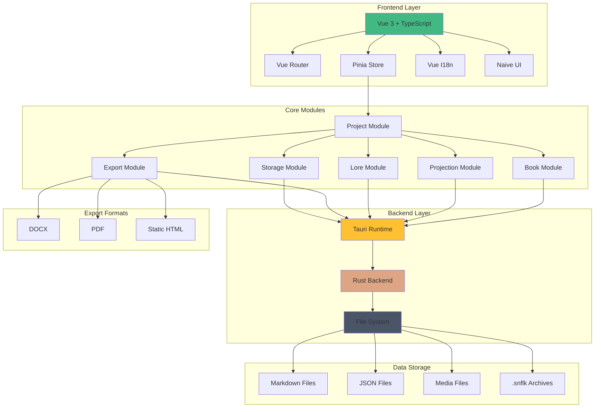

# Snowflake Architecture

## System Landscape

## Component Description

### Frontend Layer

- **Vue 3 + TypeScript**: Main framework for user interface development
- **Vue Router**: Application routing
- **Pinia Store**: Application state management
- **Vue I18n**: Internationalization
- **Naive UI**: UI component library

### Core Modules

- **Project Module**: Project and configuration management
- **Book Module**: Book and series management
- **Projection Module**: Book planning and structuring
- **Lore Module**: World and character management
- **Export Module**: Export to various formats
- **Storage Module**: Data storage management

### Backend Layer

- **Tauri Runtime**: Desktop environment
- **Rust Backend**: Native operations and business logic
- **File System**: File system operations

### Data Storage

- **Markdown Files**: Text content storage
- **JSON Files**: Structured data storage
- **Media Files**: Image and media storage
- **SNFLK Archives**: Project archives

### Export Formats

- **DOCX**: Export to Microsoft Word format
- **PDF**: Export to PDF format
- **HTML**: Export to static web pages

## Component Interaction

1. Frontend interacts with Core Modules through Pinia Store
2. Core Modules communicate with Backend Layer via Tauri API
3. Backend Layer manages data through File System
4. Export Module generates various document formats
5. Storage Module manages all types of stored data

## Architecture Features

- Modular structure for easy expansion
- Clear separation of responsibilities between layers
- Use of native capabilities through Rust
- Flexible data storage system
- Support for various export formats

## Technical Implementation Details

1. Use of project folder
2. Data storage in .md and .json files + media files (images .jpg, .png)
3. Use of folder structure for data organization
4. Generation of zip folder in .snflk format (for project copy storage)
5. Project import from .snflk
6. Project export in different views and formats:
   - Book in docx, pdf
   - World lore in static html + media assets
   - Materials for publishers in docx
   - Special book markup in docx format for editor/proofreader with text back-sync capability

## Quality Criteria

### Performance

- Response time <200ms
- Optimal memory usage
- Stable operation under maximum load

### Reliability

- Auto-save every 5 minutes
- Recovery after failures
- Data backup

### Security

- Sensitive data encryption
- Protection against injections
- Secure data storage

### Usability

- Intuitive interface
- Presence of hints
- Keyboard navigation support
