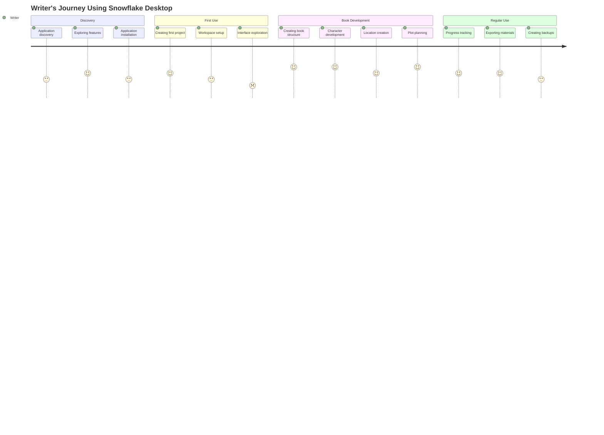
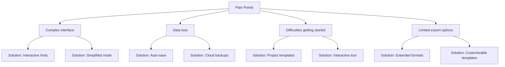

# Customer Journey Map

## Overview

The Customer Journey Map is a visualization of the writer's interaction process with the Snowflake Desktop application from first discovery to regular use in working on literary works.

## Customer Journey Stages

## Detailed Customer Journey Analysis

### 1. Discovery

| Stage                    | User Actions                                                           | Touchpoints                          | Emotions                 | Improvement Opportunities                                    |
| ------------------------ | ---------------------------------------------------------------------- | ------------------------------------ | ------------------------ | ------------------------------------------------------------ |
| Application discovery    | Searching for writer tools, reading reviews, recommendations           | Website, social media, writer forums | Interest, curiosity      | SEO improvement, user reviews, demonstration videos          |
| Exploring features       | Reading descriptions, viewing screenshots, comparing with alternatives | Website, documentation, reviews      | Evaluation, analysis     | More visual usage examples, interactive demonstration        |
| Application installation | Download, installation, first launch                                   | Download page, installer             | Anticipation, impatience | Simplifying installation process, reducing distribution size |

### 2. First Use

| Stage                  | User Actions                                | Touchpoints           | Emotions                | Improvement Opportunities              |
| ---------------------- | ------------------------------------------- | --------------------- | ----------------------- | -------------------------------------- |
| Creating first project | Filling project information, selecting type | Project creation form | Enthusiasm, uncertainty | Project templates, step-by-step hints  |
| Workspace setup        | Exploring settings, adapting to needs       | Settings menu         | Exploration, adaptation | Preset setting profiles, visual cues   |
| Interface exploration  | Navigating sections, learning features      | Application interface | Possible confusion      | Interactive application tour, tooltips |

### 3. Book Development

| Stage                   | User Actions                            | Touchpoints      | Emotions                       | Improvement Opportunities                    |
| ----------------------- | --------------------------------------- | ---------------- | ------------------------------ | -------------------------------------------- |
| Creating book structure | Adding chapters, scenes, planning       | Structure module | Creative process, organization | Structure visualization, structure templates |
| Character development   | Creating character cards, relationships | Character module | Creative inspiration           | Name generator, archetype templates          |
| Location creation       | Describing settings, connections        | Location module  | World immersion                | Visual map editor, references                |
| Plot planning           | Creating storylines, arcs               | Plot module      | Strategic thinking             | Plot structure analysis, suggestions         |

### 4. Regular Use

| Stage               | User Actions                          | Touchpoints           | Emotions                  | Improvement Opportunities         |
| ------------------- | ------------------------------------- | --------------------- | ------------------------- | --------------------------------- |
| Progress tracking   | Updating statuses, viewing statistics | Dashboard, statistics | Motivation, control       | Progress visualization, reminders |
| Exporting materials | Choosing format, export settings      | Export module         | Satisfaction with results | More formats, preview             |
| Creating backups    | Setting up auto-save, backups         | Save settings         | Security, peace of mind   | Cloud storage, automation         |

## Pain Points and Solutions

## Key Success Metrics

1. **Activation**: Percentage of users who created a full book project after installation
2. **Retention**: Frequency and duration of application work sessions
3. **Engagement**: Number of created elements (characters, locations, scenes)
4. **Completion**: Percentage of projects that reached "Completed" status
5. **Satisfaction**: User ratings, reviews, number of recommendations

## Recommendations for Improving Customer Journey

1. **Onboarding**: Develop an interactive tour of the application's main features
2. **Templates**: Create a set of ready-made templates for different literary genres
3. **Gamification**: Implement gamification elements to increase motivation
4. **Community**: Create a platform for experience exchange between users
5. **Integrations**: Add integrations with popular services for writers
