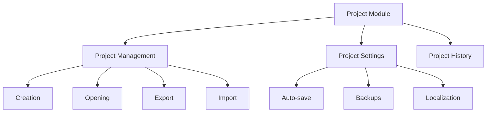
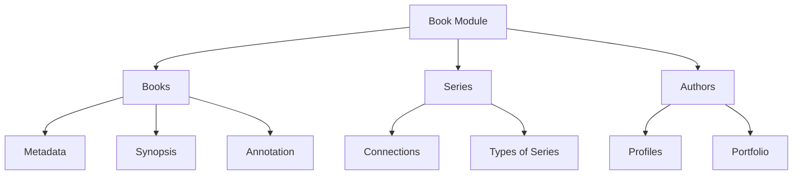
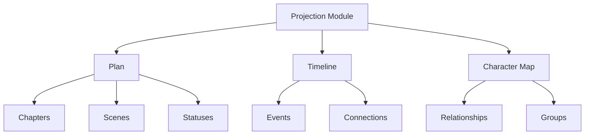
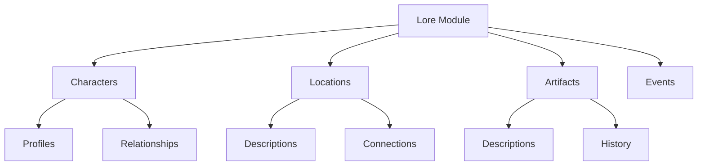

# Key Features of the Project

## Main Modules

### 1. Project Module (Project Management)

- Creation and management of projects
- Auto-save every 5 minutes
- Backup system
- History of recent projects
- Export/import in .snflk format

### 2. Book Module (Book Management)

- Management of books and series
- Creation of connections between books
- Management of authors and their portfolios
- Support for various types of series

### 3. Projection Module (Projections and Planning)

- Planning the structure of the book
- Management of chapters and scenes
- Timeline of events
- Character map and their connections

### 4. Lore Module (Content Management)

- Management of characters and their profiles
- Creation and editing of locations
- Management of artifacts and items
- Description of events and their connections

## Technical Features

### Performance

- Response time < 200ms
- Optimized for large projects
- Efficient memory management

### Security

- Encryption of sensitive data
- Secure file storage
- Data loss protection

### User Experience

- Intuitive interface
- Support for dark theme
- Hotkeys
- Drag-and-drop interface

### Export Formats

- DOCX (with formatting preserved)
- PDF (with automatic table of contents)
- HTML (for web publication)
- .snflk (project format)

## Planned Features

### AI Integration

- Character name generation
- Assistance in creating descriptions
- Plot coherence analysis

### Collaboration

- Collaborative editing
- Comments and notes
- Versioning system

### Advanced Analytics

- Text statistics
- Character analysis
- Progress tracking
