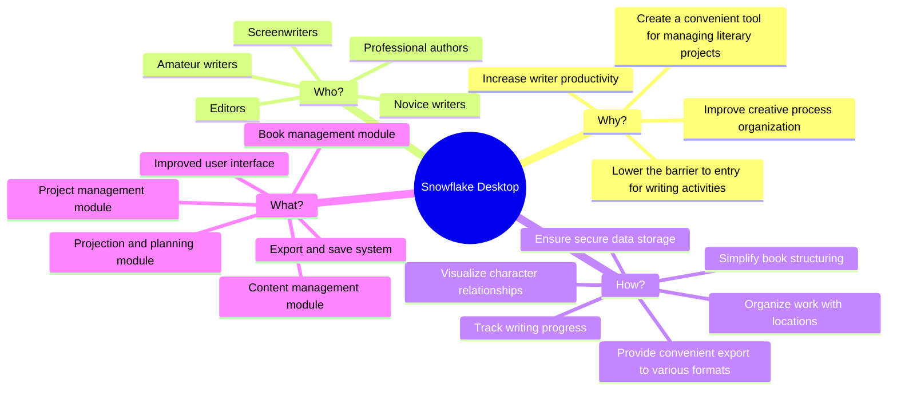
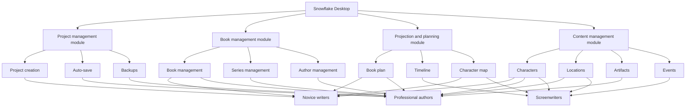

# Impact Mapping

## Overview

Impact mapping is a strategic planning tool that helps the team focus on business goals and determine how various actions affect the achievement of these goals. For the Snowflake Desktop project, the impact map shows the relationship between business goals, stakeholders, their behavior, and specific application features.

## Impact Map Structure

## Impact Map Details

### 1. Why? (Business Goals)

| Goal                                                    | Success Metric                                 | Target Value            |
| ------------------------------------------------------- | ---------------------------------------------- | ----------------------- |
| Increase writer productivity                            | Average number of words written per day        | 30% increase            |
| Improve creative process organization                   | Time spent on planning                         | 40% reduction           |
| Lower the barrier to entry for writing activities       | Number of completed projects by novice authors | 50% increase            |
| Create a convenient tool for managing literary projects | User satisfaction                              | Rating of 4.5+ out of 5 |

### 2. Who? (Stakeholders)

| Stakeholder          | Needs                                            | Pain Points                                              |
| -------------------- | ------------------------------------------------ | -------------------------------------------------------- |
| Novice writers       | Ease of use, educational materials               | Difficulty structuring ideas, uncertainty in the process |
| Professional authors | Flexibility, advanced features, reliability      | Time lost on organization, risk of data loss             |
| Screenwriters        | Visualization of story arcs, work with dialogues | Difficulty tracking multiple storylines                  |
| Editors              | Ability to comment, track changes                | Inefficient communication with authors                   |
| Amateur writers      | Accessibility, basic functions                   | Lack of motivation, misunderstanding of the process      |

### 3. How? (Behavior Changes)

| Behavior Change                   | Impact on Goal                                | Metric                                         |
| --------------------------------- | --------------------------------------------- | ---------------------------------------------- |
| Simplify book structuring         | Increased productivity, improved organization | Time spent on planning structure               |
| Visualize character relationships | Improved organization, lower barrier to entry | Number of characters and relationships created |
| Organize work with locations      | Improved creative process organization        | Time spent searching for location information  |
| Track writing progress            | Increased productivity, motivation            | Regularity of application use                  |
| Ensure secure data storage        | Creating a convenient tool                    | Amount of lost data (tends to zero)            |
| Provide convenient export         | Increased productivity                        | Time spent preparing materials                 |

### 4. What? (Functionality)

| Functionality                  | Impact on Behavior                                | Priority |
| ------------------------------ | ------------------------------------------------- | -------- |
| Project management module      | Work organization, secure storage                 | High     |
| Book management module         | Book structuring                                  | High     |
| Projection and planning module | Progress tracking, structuring                    | Medium   |
| Content management module      | Relationship visualization, location organization | Medium   |
| Export and save system         | Secure storage, convenient export                 | High     |
| Improved user interface        | All behavior changes                              | High     |

## Extended Impact Map by Modules

## Key Findings

1. **Focus on user experience**: The most important aspect is creating an intuitive interface that will be accessible to both beginners and experienced writers.

2. **Data security priority**: Ensuring reliable storage and backup is critical for all user groups.

3. **Balance of simplicity and functionality**: It is necessary to find a balance between ease of use for beginners and advanced features for professionals.

4. **Phased implementation**: It is recommended to start with basic modules (project and book management) and gradually add more complex features.

5. **Feedback**: It is important to regularly collect feedback from users to adjust the direction of product development.

## Implementation Recommendations

1. **MVP (Minimum Viable Product)**: Focus on the project management module and basic functions of the book management module.

2. **Second stage**: Add export functions and improve the user interface based on feedback.

3. **Third stage**: Implement projection and content management modules.

4. **Fourth stage**: Add advanced features for professional users and integration with other services.
