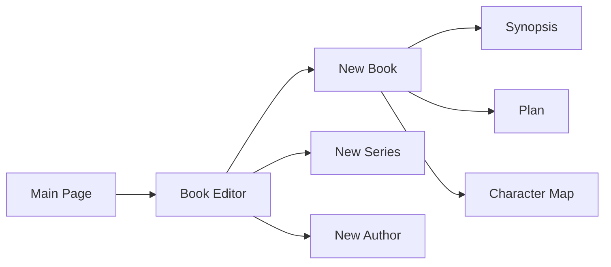
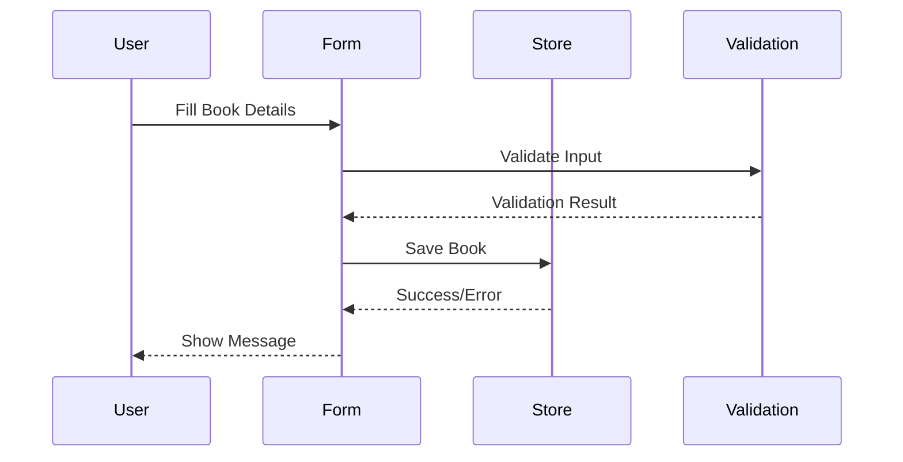

# Navigation

[Back to README](readme.md)

## Navigation Structure

## Book Creation Process

## Additional Materials

- [Customer Journey Map](customer-journey-map.md) - visualization of the user's interaction process with the application
- [Impact Mapping](impact-mapping.md) - strategic planning tool showing the relationship between business goals and application features
