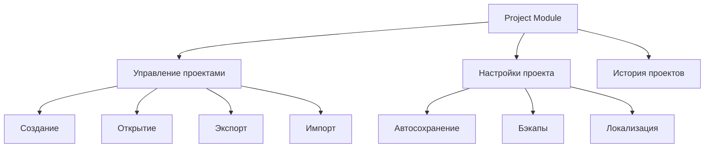
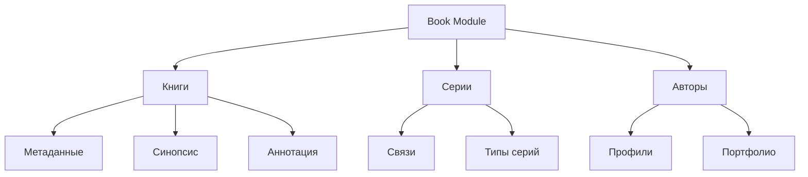
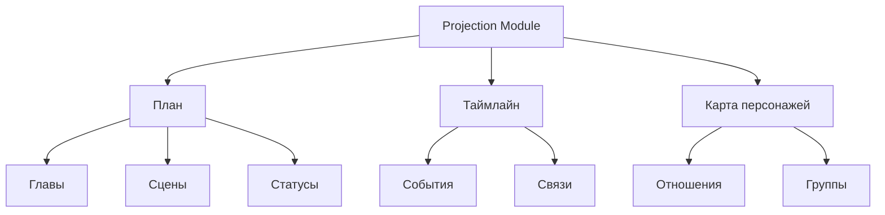
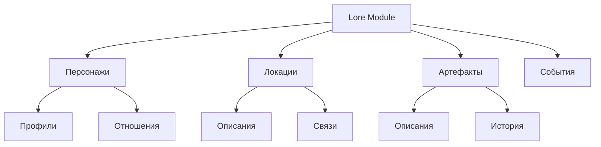

# Ключевые возможности проекта

## Основные модули

### 1. Project Module (Управление проектами)

- Создание и управление проектами
- Автосохранение каждые 5 минут
- Система бэкапов
- История недавних проектов
- Экспорт/импорт в формате .snflk

### 2. Book Module (Управление книгами)

- Управление книгами и сериями
- Создание связей между книгами
- Управление авторами и их портфолио
- Поддержка различных типов серий

### 3. Projection Module (Проекции и планирование)

- Планирование структуры книги
- Управление главами и сценами
- Таймлайн событий
- Карта персонажей и их связей

### 4. Lore Module (Управление контентом)

- Управление персонажами и их профилями
- Создание и редактирование локаций
- Управление артефактами и предметами
- Описание событий и их связей

## Технические особенности

### Производительность

- Время отклика < 200ms
- Оптимизированная работа с большими проектами
- Эффективное управление памятью

### Безопасность

- Шифрование чувствительных данных
- Безопасное хранение файлов
- Защита от потери данных

### Пользовательский опыт

- Интуитивный интерфейс
- Поддержка тёмной темы
- Горячие клавиши
- Drag-and-drop интерфейс

### Форматы экспорта

- DOCX (с сохранением форматирования)
- PDF (с автоматическим оглавлением)
- HTML (для веб-публикации)
- .snflk (формат проекта)

## Планируемые возможности

### AI интеграция

- Генерация имён персонажей
- Помощь в создании описаний
- Анализ связности сюжета

### Коллаборация

- Совместное редактирование
- Комментарии и заметки
- Система версионирования

### Расширенная аналитика

- Статистика по тексту
- Анализ персонажей
- Отслеживание прогресса
