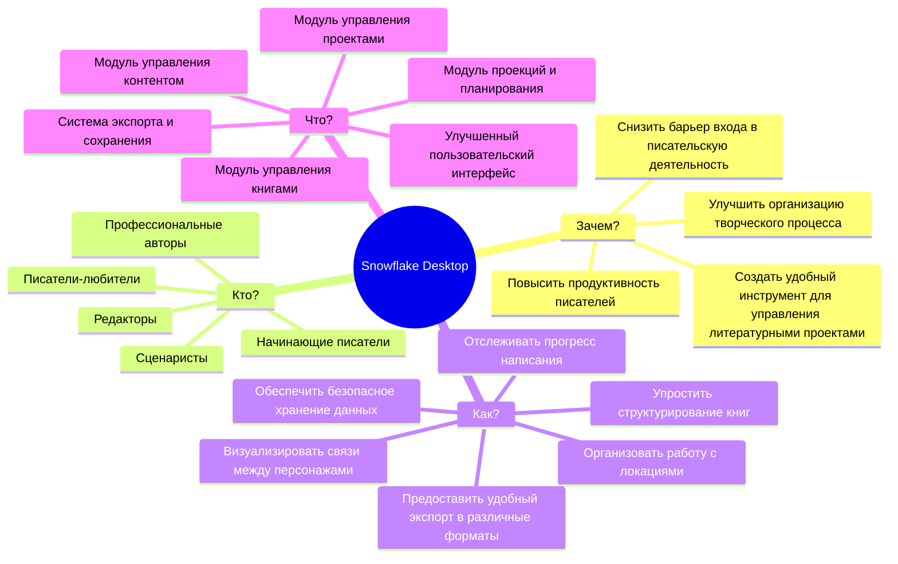
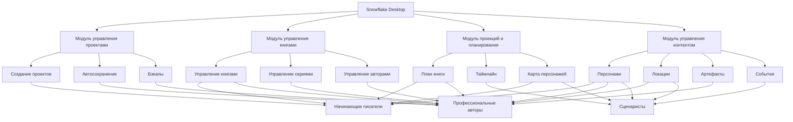

# Карта влияния (Impact Mapping)

## Обзор

Карта влияния - это стратегический инструмент планирования, который помогает команде сосредоточиться на бизнес-целях и определить, как различные действия влияют на достижение этих целей. Для проекта Snowflake Desktop карта влияния показывает связь между бизнес-целями, заинтересованными сторонами, их поведением и конкретными функциями приложения.

## Структура карты влияния

## Детализация карты влияния

### 1. Зачем? (Бизнес-цели)

| Цель                                                              | Метрика успеха                                       | Целевое значение  |
| ----------------------------------------------------------------- | ---------------------------------------------------- | ----------------- |
| Повысить продуктивность писателей                                 | Среднее количество написанных слов в день            | Увеличение на 30% |
| Улучшить организацию творческого процесса                         | Время, затрачиваемое на планирование                 | Сокращение на 40% |
| Снизить барьер входа в писательскую деятельность                  | Количество завершенных проектов начинающими авторами | Увеличение на 50% |
| Создать удобный инструмент для управления литературными проектами | Удовлетворенность пользователей                      | Оценка 4.5+ из 5  |

### 2. Кто? (Заинтересованные стороны)

| Заинтересованная сторона | Потребности                                         | Болевые точки                                             |
| ------------------------ | --------------------------------------------------- | --------------------------------------------------------- |
| Начинающие писатели      | Простота использования, обучающие материалы         | Сложность структурирования идей, неуверенность в процессе |
| Профессиональные авторы  | Гибкость, расширенные возможности, надежность       | Потеря времени на организацию, риск потери данных         |
| Сценаристы               | Визуализация сюжетных арок, работа с диалогами      | Сложность отслеживания множества сюжетных линий           |
| Редакторы                | Возможность комментирования, отслеживание изменений | Неэффективная коммуникация с авторами                     |
| Писатели-любители        | Доступность, базовые функции                        | Отсутствие мотивации, непонимание процесса                |

### 3. Как? (Изменения в поведении)

| Изменение в поведении                   | Влияние на цель                                 | Метрика                                         |
| --------------------------------------- | ----------------------------------------------- | ----------------------------------------------- |
| Упростить структурирование книг         | Повышение продуктивности, улучшение организации | Время, затрачиваемое на планирование структуры  |
| Визуализировать связи между персонажами | Улучшение организации, снижение барьера входа   | Количество созданных персонажей и связей        |
| Организовать работу с локациями         | Улучшение организации творческого процесса      | Время поиска информации о локациях              |
| Отслеживать прогресс написания          | Повышение продуктивности, мотивация             | Регулярность использования приложения           |
| Обеспечить безопасное хранение данных   | Создание удобного инструмента                   | Количество потерянных данных (стремится к нулю) |
| Предоставить удобный экспорт            | Повышение продуктивности                        | Время, затрачиваемое на подготовку материалов   |

### 4. Что? (Функциональность)

| Функциональность                      | Влияние на поведение                     | Приоритет |
| ------------------------------------- | ---------------------------------------- | --------- |
| Модуль управления проектами           | Организация работы, безопасное хранение  | Высокий   |
| Модуль управления книгами             | Структурирование книг                    | Высокий   |
| Модуль проекций и планирования        | Отслеживание прогресса, структурирование | Средний   |
| Модуль управления контентом           | Визуализация связей, организация локаций | Средний   |
| Система экспорта и сохранения         | Безопасное хранение, удобный экспорт     | Высокий   |
| Улучшенный пользовательский интерфейс | Все изменения в поведении                | Высокий   |

## Расширенная карта влияния по модулям

## Ключевые выводы

1. **Фокус на пользовательском опыте**: Наиболее важным аспектом является создание интуитивно понятного интерфейса, который будет доступен как начинающим, так и опытным писателям.

2. **Приоритет безопасности данных**: Обеспечение надежного хранения и резервного копирования является критически важным для всех групп пользователей.

3. **Баланс простоты и функциональности**: Необходимо найти баланс между простотой использования для новичков и расширенными возможностями для профессионалов.

4. **Поэтапное внедрение**: Рекомендуется начать с базовых модулей (управление проектами и книгами) и постепенно добавлять более сложные функции.

5. **Обратная связь**: Важно регулярно собирать обратную связь от пользователей для корректировки направления развития продукта.

## Рекомендации по реализации

1. **MVP (Минимально жизнеспособный продукт)**: Сосредоточиться на модуле управления проектами и базовых функциях модуля управления книгами.

2. **Второй этап**: Добавить функции экспорта и улучшить пользовательский интерфейс на основе обратной связи.

3. **Третий этап**: Реализовать модули проекций и управления контентом.

4. **Четвертый этап**: Добавить расширенные функции для профессиональных пользователей и интеграции с другими сервисами.

## Английская версия (English Version)

Для создания английской версии этого документа, пожалуйста, используйте команду перевода и сохраните результат в папке `docs/en/impact-mapping.md`.
