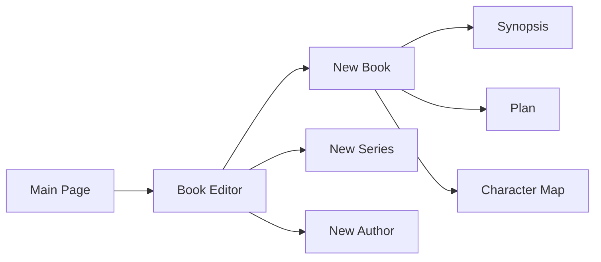
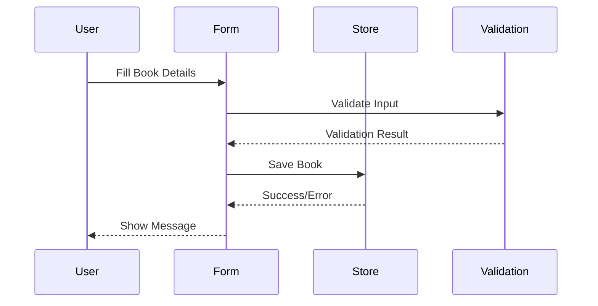

# Навигация

[Назад к README](readme.md)

// Start Generation Here

## Навигационная структура

```mermaid
graph LR
    A[Main Page] --> B[Book Editor]
    B --> C[New Book]
    B --> D[New Series]
    B --> E[New Author]
    C --> F[Synopsis]
    C --> G[Plan]
    C --> H[Character Map]
```

## Процесс создания книги

```mermaid
sequenceDiagram
    participant U as User
    participant F as Form
    participant S as Store
    participant V as Validation

    U->>F: Fill Book Details
    F->>V: Validate Input
    V-->>F: Validation Result
    F->>S: Save Book
    S-->>F: Success/Error
    F-->>U: Show Message
```
