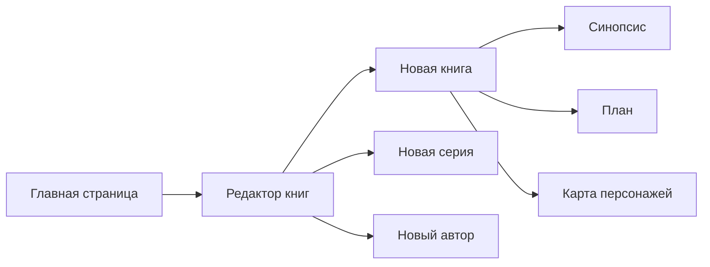
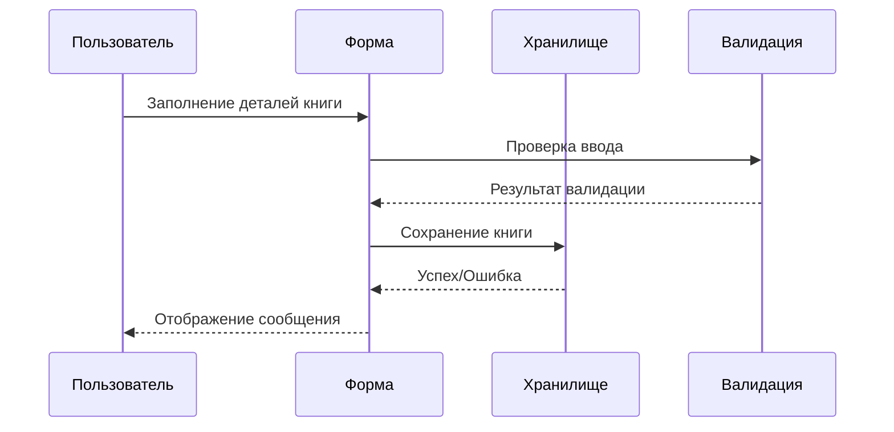

# Навигация

[Назад к README](readme.md)

## Навигационная структура

```mermaid
graph LR
    A[Главная страница] --> B[Редактор книг]
    B --> C[Новая книга]
    B --> D[Новая серия]
    B --> E[Новый автор]
    C --> F[Синопсис]
    C --> G[План]
    C --> H[Карта персонажей]
```

## Процесс создания книги

```mermaid
sequenceDiagram
    participant U as Пользователь
    participant F as Форма
    participant S as Хранилище
    participant V as Валидация

    U->>F: Заполнение деталей книги
    F->>V: Проверка ввода
    V-->>F: Результат валидации
    F->>S: Сохранение книги
    S-->>F: Успех/Ошибка
    F-->>U: Отображение сообщения
```
