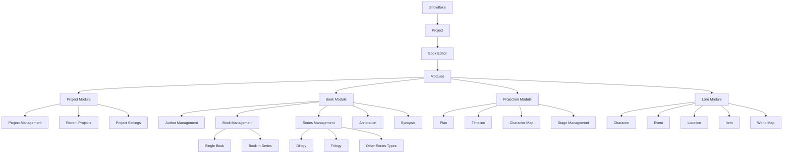
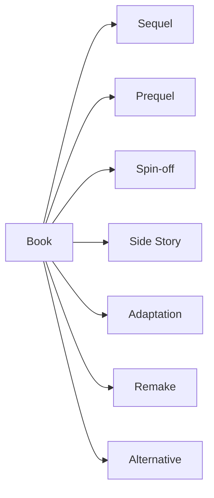
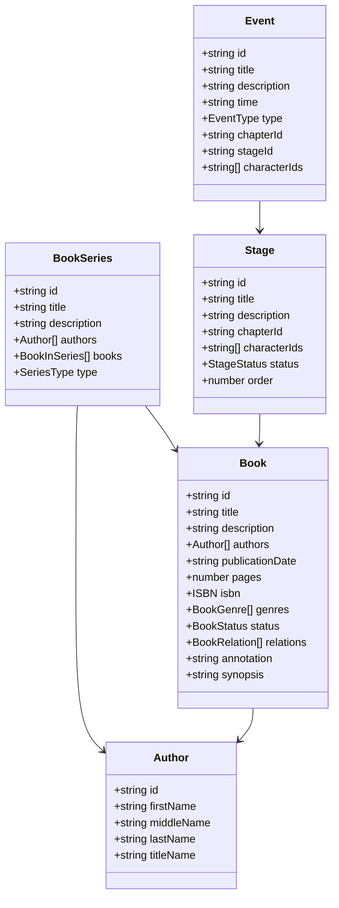

# Структура проекта

[Назад к README](readme.md)

## Структура модулей

```mermaid
graph TD
    A[Snowflake] --> P[Project]
    P --> B[Book Editor]
    B --> M[Modules]

    M --> Project[Project Module]
    M --> C[Book Module]
    M --> D[Projection Module]
    M --> E[Lore Module]

    Project --> P1[Project Management]
    Project --> P2[Recent Projects]
    Project --> P3[Project Settings]

    C --> C1[Author Management]
    C --> C2[Book Management]
    C --> C3[Series Management]
    C --> C4[Annotation]
    C --> C5[Synopsis]

    D --> D1[Plan]
    D --> D2[Timeline]
    D --> D3[Character Map]
    D --> D4[Stage Management]

    E --> E1[Character]
    E --> E2[Event]
    E --> E3[Location]
    E --> E4[Item]
    E --> E5[World Map]

    C2 --> C2_1[Single Book]
    C2 --> C2_2[Book in Series]
    C3 --> C3_1[Dilogy]
    C3 --> C3_2[Trilogy]
    C3 --> C3_3[Other Series Types]
```

## Типы связей между книгами

```mermaid
graph LR
    A[Book] --> B[Sequel]
    A --> C[Prequel]
    A --> D[Spin-off]
    A --> E[Side Story]
    A --> F[Adaptation]
    A --> G[Remake]
    A --> H[Alternative]
```

## Структура данных книги

```mermaid
classDiagram
    class Book {
      +string id
      +string title
      +string description
      +Author[] authors
      +string publicationDate
      +number pages
      +ISBN isbn
      +BookGenre[] genres
      +BookStatus status
      +BookRelation[] relations
      +string annotation
      +string synopsis
    }
    class Author {
      +string id
      +string firstName
      +string middleName
      +string lastName
      +string titleName
    }
    class BookSeries {
      +string id
      +string title
      +string description
      +Author[] authors
      +BookInSeries[] books
      +SeriesType type
    }
    class Stage {
      +string id
      +string title
      +string description
      +string chapterId
      +string[] characterIds
      +StageStatus status
      +number order
    }
    class Event {
      +string id
      +string title
      +string description
      +string time
      +EventType type
      +string chapterId
      +string stageId
      +string[] characterIds
    }
    Book --> Author
    BookSeries --> Author
    BookSeries --> Book
    Stage --> Book
    Event --> Stage
```
